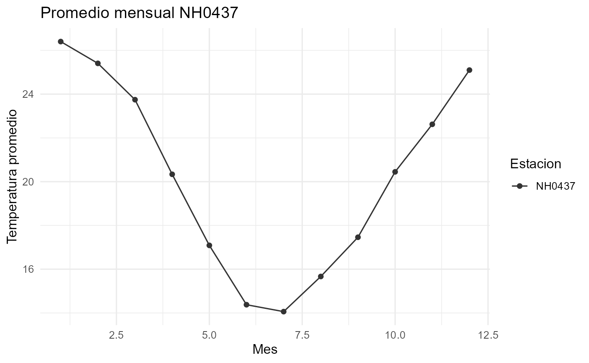

# Uso del paquete paqueteR

## Introducción

Este paquete permite leer y analizar datos meteorológicos de distintas
estaciones.

## Cargar los datos

``` r
library(paqueteR)
data("NH0437")
head(NH0437)
```

    ## # A tibble: 6 × 35
    ##   id     fecha      temperatura_abrigo_150cm temperatura_abrigo_150cm_maxima
    ##   <chr>  <date>                        <dbl>                           <dbl>
    ## 1 NH0437 1970-08-01                     23.3                            31.2
    ## 2 NH0437 1970-08-02                     26.6                            32.1
    ## 3 NH0437 1970-08-03                     17.4                            22.9
    ## 4 NH0437 1970-08-04                     11.0                            11.9
    ## 5 NH0437 1970-08-05                     11.1                            12.6
    ## 6 NH0437 1970-08-06                     13.6                            15.1
    ## # ℹ 31 more variables: temperatura_abrigo_150cm_minima <dbl>,
    ## #   temperatura_intemperie_5cm_minima <dbl>,
    ## #   temperatura_intemperie_50cm_minima <dbl>,
    ## #   temperatura_suelo_5cm_media <dbl>, temperatura_suelo_10cm_media <lgl>,
    ## #   temperatura_inte_5cm <lgl>, temperatura_intemperie_150cm_minima <lgl>,
    ## #   humedad_suelo <lgl>, precipitacion_pluviometrica <dbl>, granizo <dbl>,
    ## #   nieve <dbl>, heliofania_efectiva <dbl>, heliofania_relativa <dbl>, …

\#Resumen de temperatura Podemos obtener un resumen estadístico por
estación (media, mínimo, máximo, etc.) con la función
tabla_resumen_temperatura().

``` r
tabla_resumen_temperatura(NH0437)
```

    ## Resumen generado correctamente para 1 estacion(es).

    ## # A tibble: 1 × 6
    ##   id     media minimo maximo desviacion n_observaciones
    ##   <chr>  <dbl>  <dbl>  <dbl>      <dbl>           <int>
    ## 1 NH0437  20.2    2.1   36.3       5.77           18738

\#Gráfico mensual También podemos visualizar la temperatura promedio
mensual con grafico_temperatura_mensual().

``` r
grafico_temperatura_mensual(NH0437, titulo = "Promedio mensual NH0437")
```



\#Conclusión El paquete paqueteR permite automatizar el proceso de
lectura, resumen y visualización de datos meteorológicos, simplificando
el análisis exploratorio de estaciones.
